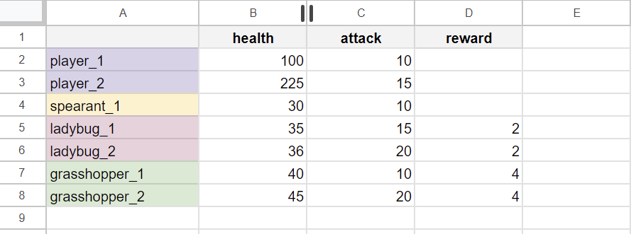

> This package is used to download game data from a Google Spreadsheet and URL sources to update local configs (ScriptableObject).
> **Limitations**: One **SpreadsheetSyncer** can fetch data from one Google Spreadsheet. Add multiple syncers or use fetcher assets

### 📦 How to install
1. Requires [Git](https://git-scm.com/) for installing package.
2. Open Unity Package Manager
3. Add package via git URL 
```
    https://github.com/vstrucovski/UnityBlocks.DataSync.git
```
OR add directly to manifest
```
    "unityblocks.data-sync": "https://github.com/vstrucovski/UnityBlocks.DataSync.git"
```

---
### 1. Spreadsheet with values
The first row is used for data binding. <br>
The names should match your target ScriptableObject properties/fields. <br>
Each row represents a ScriptableObject instance. <br>



Where to find your sheet id. Will be used later in code


---
### 2. How to use
Create new gameobject and add SpreadsheetSyncer <br>


then to create needed config and assign it to component above


#### Example

Tag your ScriptableObject with interface ISpreadsheetBindable and implement Parse()
```cs
    [CreateAssetMenu(menuName = "MyGame/UnitData")]
    public class UnitData : ScriptableObject, ISpreadsheetBindable
    {
        [field: SerializeField] public string id { get; set; } //first column
        public int health;                                     //second column
        public float attack;                                   //third column

        public void Parse(SpreadsheetLine spreadsheetData)
        {
            DataBinder.Bind(this, spreadsheetData);
        }
    }
```

---
### 3. Auto fetching
To automatically populate a group of ScriptableObjects with data from a spreadsheet, extend the ScriptableObjectTypedGroup class, as demonstrated in Example 3. <br>Additionally, ensure the "Is Single Type" checkbox is enabled on the SpreadsheetSyncer component.  
